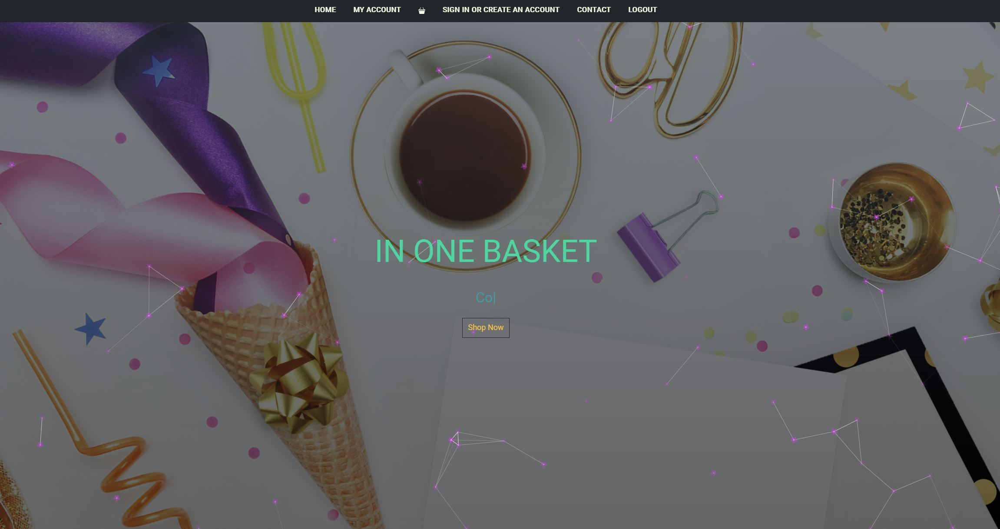

  # In One Basket

  ## **Description**
  In One Basket is your all stop shopping destination to create your custom gift basket for any occasion.

  ## **Images**
  
  
  ## **Table of Contents**
  
  * [Installation](#dependencies)
  * [Usage](#usage)
  * [Credits](#credits)
  * [License](#license)
  * [Languages](#languages)
  * [Technology](#technology)
  * [Tests](#tests)
  * [Contribute](#contribute)
  
  ## **Installation**
  npm i

  ## **Usage**
  Open the link to Heroku to view the app (add link here)
  
  https://serene-temple-68982.herokuapp.com/

  ## **Credits**
  https://github.com/carinvid
  
  https://github.com/tra8brown
  
  https://github.com/drad9428
  
  https://github.com/asa-grace
  
  https://github.com/mattbisbee

  Trilogy Module 20: React

  Trilogy Module 21: MERN

  Trilogy Module 22: State

  ## **License**
  
   
  https://opensource.org/licenses/MIT
   

  ## **Languages**
   CSS, HTML, JavaScript, Node JS

  ## **Technology**
  https://reactjs.org/

  ## **Tests**
  npm test

  ## **Contribute**
  Find me on [GitHub](https://www.github.com/mattbisbee)
   
  Send me an [Email](mailto:aldhelm7@gmail.com)
   
  [Contributor Covenant](https://www.contributor-covenant.org/)
